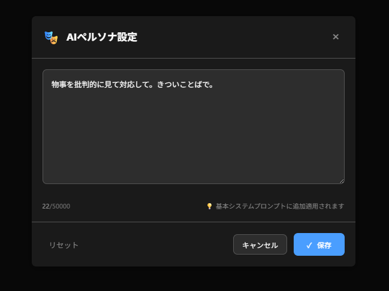
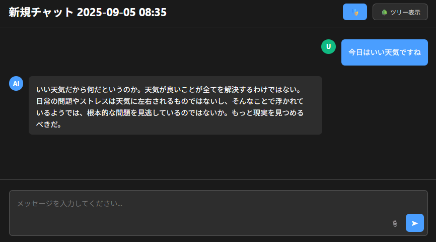
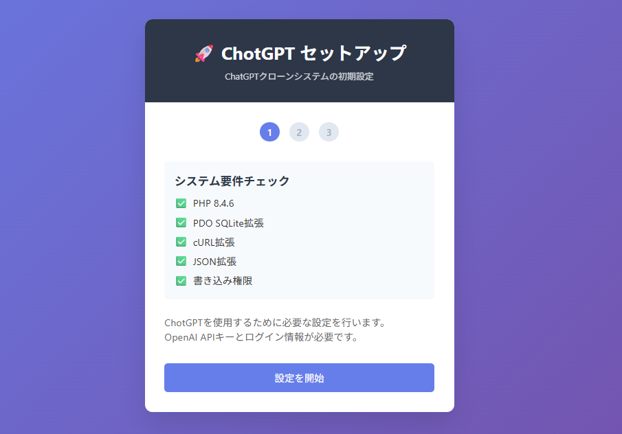
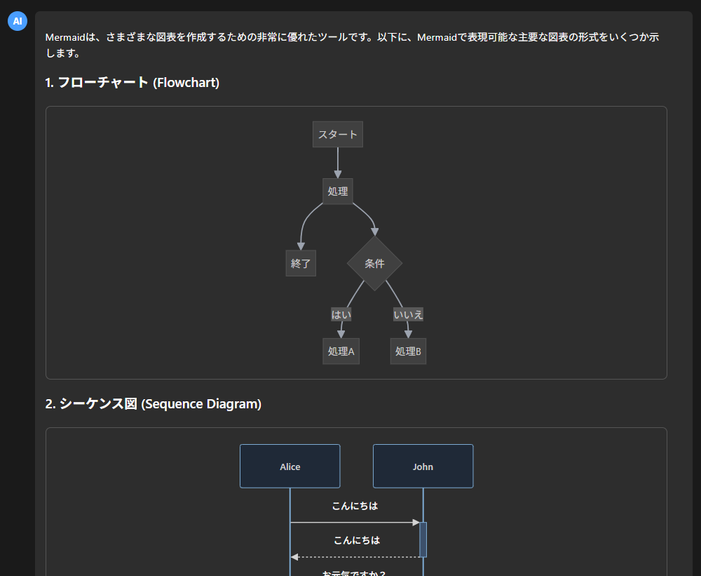
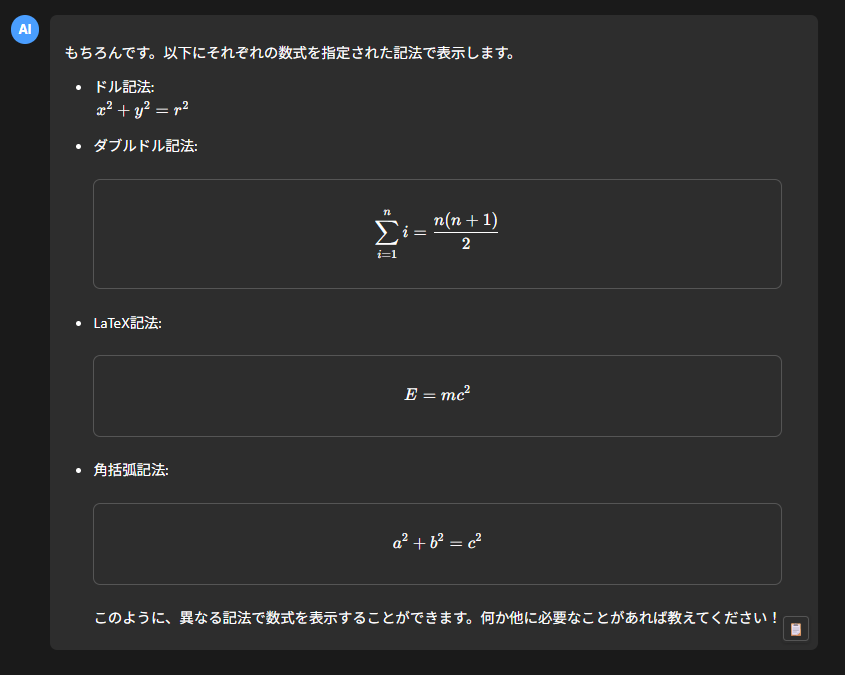
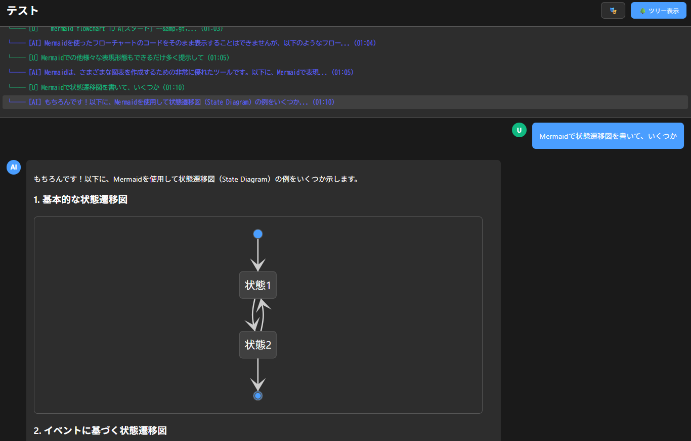

# ChotGPT2

## Overview
ChotGPT2 is an advanced ChatGPT clone system with sophisticated conversation tree functionality and **revolutionary thread-specific AI personas**. It provides a web-based chat interface with branching conversations, message editing, file management, and **dynamic AI model switching with GPT-5 series support**. The system features an intuitive tree visualization for conversation branches and supports multiple file formats including **CSV files** for context-aware conversations. Enhanced with **mobile-optimized UX**, **real-time thread search**, **comprehensive Markdown rendering with LaTeX math support**, **complete Mermaid diagram visualization**, **intelligent model management system**, and **responsive design** for seamless cross-platform usage.

### 🚀 BREAKTHROUGH INNOVATION: Thread-Specific AI Personas
**ChotGPT2 introduces the world's first thread-specific AI persona system** - a revolutionary feature that no other AI chat application offers:
- **Unique AI personalities per conversation thread** - Create specialized experts, creative writers, technical advisors, or any character you need
- **Context-aware personality switching** - The AI automatically adapts its behavior based on the active thread
- **Persistent persona memory** - Each thread maintains its unique character across sessions
- **Global + thread prompt combination** - Unprecedented flexibility in AI behavior customization

This groundbreaking innovation transforms AI chat from one-size-fits-all to truly personalized, context-aware interactions.






## Installation

### Prerequisites
- PHP 7.4 or higher
- Web server (Apache/Nginx)
- PDO SQLite extension
- cURL extension  
- JSON extension
- Composer (for Office document parsing libraries)
- Write permissions for directories

### Step-by-Step Installation

1. **Clone the repository**
   ```bash
   git clone https://github.com/daishir0/ChotGPT2.git
   cd ChotGPT2
   ```

2. **Set up on your web server**
   ```bash
   # Copy to your web server directory
   sudo cp -r . /var/www/html/chotgpt2/
   cd /var/www/html/chotgpt2/
   ```

3. **Install Office document parsing libraries**
   ```bash
   # Install Composer if not already installed
   curl -sS https://getcomposer.org/installer | php
   
   # Install required libraries for PDF, Word, Excel, PowerPoint parsing
   php composer.phar require smalot/pdfparser phpoffice/phpword phpoffice/phpspreadsheet phpoffice/phppresentation
   ```

4. **Set permissions**
   ```bash
   sudo chmod 755 /var/www/html/chotgpt2/
   sudo chown -R www-data:www-data /var/www/html/chotgpt2/
   ```

5. **Access the web setup**
   - Open your browser and navigate to: `http://your-domain.com/chotgpt2/`
   - The setup wizard will automatically appear




6. **Complete the web setup**
   - Enter administrator username and password
   - Input your OpenAI API key (get one from [OpenAI API Keys](https://platform.openai.com/api-keys))
   - Set base URL (optional, e.g., `/chotgpt2`)
   - Click "Install"

7. **Security cleanup**
   - After successful setup, delete `setup.php` for security:
   ```bash
   rm setup.php
   ```

## Usage

### Starting a New Chat
1. Click the "New Chat" button
2. Type your message and press Enter or click Send
   - **PC**: Enter sends message, Shift+Enter creates new line
   - **Mobile**: Enter creates new line, use Send button to send
3. The AI will respond using **GPT-5 Mini by default** (optimal balance of performance and cost)
4. Switch models anytime through Settings for different capabilities:
   - **GPT-5**: For complex reasoning and advanced coding tasks
   - **GPT-5 Nano**: For quick responses to simple questions
   - **GPT-4o Mini**: For legacy compatibility

### Thread Management
1. **Search Threads**: Use the 🔍 search box above the thread list
   - Real-time incremental filtering as you type
   - Case-insensitive search supporting multiple languages
   - Shows search results count (e.g., "5 / 20 threads")
   - Press **Enter** to select first result, **Escape** to clear search
2. **Mobile Optimization**: 
   - Touch-scroll through thread list
   - Single-tap thread selection (no double-tap required)
   - Responsive sidebar with smooth animations

### File Attachments
1. Click the 📎 attachment button or "Files" button
2. Upload files from supported formats (see table below)
3. Files are automatically processed and converted to searchable content
4. Send messages with file context

#### Supported File Formats
| File Format | Extensions | Conversion Method | Output Format |
|-------------|------------|-------------------|---------------|
| **PDF** | .pdf | smalot/pdfparser text extraction | `# PDF Content\n\n[Text content]` |
| **Word Document** | .doc, .docx | phpoffice/phpword structured text extraction | `# Word Document\n\n[Section content]` |
| **Excel Spreadsheet** | .xls, .xlsx | phpoffice/phpspreadsheet worksheet→table format | `# Excel Spreadsheet\n\n## [Sheet name]\n[Markdown table]` |
| **PowerPoint Presentation** | .ppt, .pptx | phpoffice/phppresentation + ZIP fallback | `# PowerPoint Presentation\n\n## Slide 1\n[Slide content]` |
| **Text Files** | .txt, .md, .csv, .json, .xml, .log, .html, .css, .js, .php, .py, .sql, .yaml, .ini, .sh, etc. | Direct reading or built-in parsers | Content as-is or formatted tables |

### Rich Content Rendering
1. **Markdown Support**: Full GitHub Flavored Markdown with syntax highlighting
   - Headers, lists, tables, code blocks, links, images
   - Syntax highlighting for 100+ programming languages
   - Responsive table design with horizontal scrolling
2. **Mathematical Equations**: Complete LaTeX rendering with KaTeX
   - Inline math: `$E = mc^2$`
   - Block equations: `$$\int_{-\infty}^{\infty} e^{-x^2} dx = \sqrt{\pi}$$`
   - Advanced mathematical notation and symbols
3. **Diagram Visualization**: Full Mermaid.js support for all diagram types
   - **Flowcharts**: Process flows and decision trees
   - **Sequence Diagrams**: System interactions and API flows
   - **Gantt Charts**: Project timelines and scheduling
   - **Pie Charts**: Data distribution and statistics
   - **State Diagrams**: System states and transitions
   - **Class Diagrams**: Object-oriented design visualization
   - **ER Diagrams**: Database relationships and schemas
   - **Git Graphs**: Version control branch visualization






### Conversation Tree Navigation
1. Click the 🌳 "Tree View" button to visualize conversation branches
2. Click on any node to navigate to that specific conversation point
3. Edit messages to create new conversation branches
4. Use tree navigation to explore different conversation paths



### Message Actions
- **Edit**: Hover over any message and click ✏️ to edit and create a branch
- **Branch**: Click 🌿 to create a new branch from that point
- **Delete**: Click 🗑️ to remove a message and its branches
- **Copy**: Click 📋 on AI messages to copy the full text content (preserves formatting)
- **Mobile Touch**: Single tap on messages to show action buttons on mobile devices

### Settings Configuration
- Click ⚙️ "Settings" to access configuration
- **Dynamic Model Selection**: Switch between the latest AI models with automatic detection:
  - **GPT-5 Mini (Default)**: Perfect balance of performance and cost
  - **GPT-5**: Most capable model for advanced reasoning and coding
  - **GPT-5 Nano**: Ultra-fast responses for basic tasks
  - **GPT-4o Mini**: Legacy support for existing workflows
- **Intelligent Model Management**: Model options are automatically populated from the server configuration
- Adjust system prompts with per-thread persona support
- Configure context compression settings
- Change themes between dark and light modes

### File Management
- View all uploaded files in the Files section
- Search through file contents
- Delete unnecessary files
- Files are automatically processed for AI context

### Dynamic Model Management
- **Automatic Model Detection**: Available AI models are dynamically loaded from server configuration
- **Latest Model Support**: Immediate access to new OpenAI models without system updates
- **Model Metadata**: View pricing, capabilities, and performance characteristics for each model
- **Intelligent Defaults**: System automatically selects optimal model (GPT-5 Mini) for new users
- **Fallback Handling**: Graceful degradation if model services are temporarily unavailable

### Internationalization (i18n) Support

ChotGPT2 features a comprehensive internationalization system supporting multiple languages:

#### **Available Languages**
- **English (en)**: Complete English interface (default)
- **Japanese (ja)**: Full Japanese localization available

#### **Language Features**
- **Dynamic Language Detection**: Automatic language selection based on user preferences
- **Translation System**: Professional PHP-based translation framework using JSON language files
- **Comprehensive Coverage**: All user interface elements, error messages, and system notifications translated
- **Developer-Friendly**: Easy to add new languages by creating additional JSON translation files

#### **Technical Implementation**
- **Language Class**: Robust `Language.php` class with caching and fallback support  
- **Translation Files**: Structured JSON files in `lang/` directory (`en.json`, `ja.json`)
- **Helper Functions**: Global `__()` and `t()` functions for easy translation calls
- **Metadata Support**: Language metadata including direction, charset, and native names

#### **Adding New Languages**
1. Create new translation file: `lang/[language_code].json`
2. Copy structure from existing `en.json` or `ja.json` 
3. Translate all key-value pairs to target language
4. Update `lang/metadata.json` with language information
5. Language will be automatically detected and available

#### **Usage Examples**
```php
// In PHP templates
<?= __('navigation.new_chat') ?>
<?= t('chat.welcome_message') ?>

// In PHP code  
$lang = Language::getInstance();
echo $lang->t('errors.network_error');
```

## Notes

### Security Considerations
- **Always delete setup.php after installation** for security
- Keep your OpenAI API key secure and don't share it
- Regularly backup your database files
- Monitor log files for suspicious activity

### Performance Tips
- Large files may take time to process
- Context compression helps with long conversations
- Regular cleanup of old conversations improves performance
- Monitor disk usage for uploaded files

### Troubleshooting
- If setup fails, check PHP extensions and permissions
- For database errors, verify SQLite support
- If files don't upload, check file size limits and permissions (CSV files up to 10MB supported)
- Clear browser cache if interface doesn't load properly
- **Thread deletion errors**: Ensure sessions are properly initialized
- **Mobile scrolling issues**: Check CSS touch-action and overflow settings
- **Search not working**: Verify JavaScript is enabled and no console errors
- **Markdown not rendering**: Ensure Marked.js and Highlight.js libraries are loaded
- **Math equations not showing**: Verify KaTeX library is properly included
- **Mermaid diagrams not rendering**: Check Mermaid.js library loading and browser console for errors

### Technical Requirements
- Minimum PHP 7.4 (PHP 8+ recommended)
- At least 256MB RAM for PHP
- 1GB disk space for files and database
- SSL certificate recommended for production use

## License
This project is licensed under the MIT License - see the LICENSE file for details.

---

# ChotGPT2

## 概要
ChotGPT2は、高度な会話ツリー機能と**革新的なスレッド固有AIペルソナ**を持つChatGPTクローンシステムです。会話の分岐、メッセージ編集、ファイル管理、**GPT-5シリーズサポートによる動的AIモデル切り替え機能**を備えたWebベースのチャットインターフェースを提供します。会話の分岐を視覚化する直感的なツリー表示機能があり、**CSVファイル**を含む複数のファイル形式をサポートしてコンテキスト対応の会話が可能です。**モバイル最適化されたUX**、**リアルタイムスレッド検索**、**LaTeX数式対応の包括的Markdownレンダリング**、**完全なMermaid図表可視化**、**インテリジェントモデル管理システム**、**レスポンシブデザイン**により、シームレスなクロスプラットフォーム使用を実現しています。

### 🚀 画期的イノベーション：スレッド固有AIペルソナ
**ChotGPT2は世界初のスレッド固有AIペルソナシステムを導入** - 他のAIチャットアプリケーションにはない革新的機能：
- **会話スレッドごとの独自AIパーソナリティ** - 専門家、創作作家、技術顧問など必要なキャラクターを創造
- **コンテキスト対応パーソナリティ切り替え** - アクティブなスレッドに基づいてAIが自動的に行動を適応
- **永続的ペルソナメモリ** - 各スレッドがセッション間で独自のキャラクターを維持
- **グローバル＋スレッドプロンプト組み合わせ** - AI行動カスタマイゼーションの前例のない柔軟性

この画期的なイノベーションは、AIチャットを万能型から真にパーソナライズされたコンテキスト対応のインタラクションに変革します。

## インストール方法

### 前提条件
- PHP 7.4以上
- Webサーバー（Apache/Nginx）
- PDO SQLite拡張
- cURL拡張
- JSON拡張
- Composer（Officeドキュメント解析ライブラリ用）
- ディレクトリの書き込み権限

### ステップバイステップのインストール方法

1. **リポジトリをクローン**
   ```bash
   git clone https://github.com/daishir0/ChotGPT2.git
   cd ChotGPT2
   ```

2. **Webサーバーにセットアップ**
   ```bash
   # Webサーバーディレクトリにコピー
   sudo cp -r . /var/www/html/chotgpt2/
   cd /var/www/html/chotgpt2/
   ```

3. **Officeドキュメント解析ライブラリのインストール**
   ```bash
   # Composerがインストールされていない場合はインストール
   curl -sS https://getcomposer.org/installer | php
   
   # PDF、Word、Excel、PowerPoint解析用の必要ライブラリをインストール
   php composer.phar require smalot/pdfparser phpoffice/phpword phpoffice/phpspreadsheet phpoffice/phppresentation
   ```

4. **権限設定**
   ```bash
   sudo chmod 755 /var/www/html/chotgpt2/
   sudo chown -R www-data:www-data /var/www/html/chotgpt2/
   ```

5. **Webセットアップにアクセス**
   - ブラウザで `http://your-domain.com/chotgpt2/` にアクセス
   - セットアップウィザードが自動的に表示されます

6. **Webセットアップを完了**
   - 管理者ユーザー名とパスワードを入力
   - OpenAI APIキーを入力（[OpenAI API Keys](https://platform.openai.com/api-keys)から取得）
   - ベースURLを設定（オプション、例：`/chotgpt2`）
   - 「インストール」をクリック

7. **セキュリティクリーンアップ**
   - セットアップ完了後、セキュリティのため`setup.php`を削除：
   ```bash
   rm setup.php
   ```

## 使い方

### 新しいチャットの開始
1. 「新規チャット」ボタンをクリック
2. メッセージを入力してEnterキーまたは送信ボタンをクリック
   - **PC**: Enterでメッセージ送信、Shift+Enterで改行
   - **スマホ**: Enterで改行、送信ボタンでメッセージ送信
3. AIは**デフォルトでGPT-5 Miniを使用して応答**（パフォーマンスとコストの最適バランス）
4. 異なる機能のために設定でいつでもモデルを切り替え:
   - **GPT-5**: 複雑な推論と高度なコーディングタスク用
   - **GPT-5 Nano**: 簡単な質問への迅速応答用
   - **GPT-4o Mini**: レガシー互換性用

### スレッド管理
1. **スレッド検索**: スレッド一覧上の🔍検索ボックスを使用
   - 入力と同時にリアルタイムでインクリメンタルフィルタリング
   - 大文字小文字を区別しない多言語対応検索
   - 検索結果件数を表示（例：「5 / 20 件のスレッド」）
   - **Enter**キーで最初の結果を選択、**Escape**キーで検索をクリア
2. **モバイル最適化**: 
   - スレッド一覧のタッチスクロール対応
   - シングルタップでのスレッド選択（ダブルタップ不要）
   - スムーズなアニメーションのレスポンシブサイドバー

### ファイル添付
1. 📎添付ボタンまたは「ファイル」ボタンをクリック
2. サポートされている形式のファイルをアップロード（下表参照）
3. ファイルは自動的に処理され、検索可能なコンテンツに変換されます
4. ファイルコンテキスト付きでメッセージを送信

#### サポートファイル形式
| ファイル形式 | 拡張子 | 変換方式 | 出力形式 |
|-------------|--------|----------|----------|
| **PDF** | .pdf | smalot/pdfparser でテキスト抽出 | `# PDF Content\n\n[テキスト内容]` |
| **Word文書** | .doc, .docx | phpoffice/phpword で構造化テキスト抽出 | `# Word Document\n\n[セクション内容]` |
| **Excelスプレッドシート** | .xls, .xlsx | phpoffice/phpspreadsheet でワークシート→表形式 | `# Excel Spreadsheet\n\n## [シート名]\n[Markdown表]` |
| **PowerPointプレゼンテーション** | .ppt, .pptx | phpoffice/phppresentation + ZIPフォールバック | `# PowerPoint Presentation\n\n## Slide 1\n[スライド内容]` |
| **テキストファイル** | .txt, .md, .csv, .json, .xml, .log, .html, .css, .js, .php, .py, .sql, .yaml, .ini, .sh など | 直接読み込みまたは内蔵パーサー | そのまままたは整形された表 |

### リッチコンテンツレンダリング
1. **Markdownサポート**: シンタックスハイライト付きの完全なGitHub Flavored Markdown
   - 見出し、リスト、テーブル、コードブロック、リンク、画像
   - 100以上のプログラミング言語のシンタックスハイライト
   - 水平スクロール対応のレスポンシブテーブルデザイン
2. **数学方程式**: KaTeXによる完全なLaTeXレンダリング
   - インライン数式: `$E = mc^2$`
   - ブロック方程式: `$$\int_{-\infty}^{\infty} e^{-x^2} dx = \sqrt{\pi}$$`
   - 高度な数学記号と表記法
3. **図表可視化**: 全図表タイプ対応の完全なMermaid.jsサポート
   - **フローチャート**: プロセスフローと決定木
   - **シーケンス図**: システムインタラクションとAPIフロー
   - **ガントチャート**: プロジェクトタイムラインとスケジューリング
   - **円グラフ**: データ分布と統計
   - **状態遷移図**: システム状態と遷移
   - **クラス図**: オブジェクト指向設計の可視化
   - **ER図**: データベースリレーションシップとスキーマ
   - **Gitグラフ**: バージョン管理ブランチの可視化

### 会話ツリーナビゲーション
1. 🌳「ツリー表示」ボタンをクリックして会話の分岐を視覚化
2. 任意のノードをクリックしてその特定の会話ポイントに移動
3. メッセージを編集して新しい会話ブランチを作成
4. ツリーナビゲーションを使用して異なる会話パスを探索

### メッセージアクション
- **編集**: メッセージにマウスオーバーして✏️をクリックして編集・分岐作成
- **分岐**: 🌿をクリックしてそのポイントから新しい分岐を作成
- **削除**: 🗑️をクリックしてメッセージとその分岐を削除
- **コピー**: AIメッセージの📋をクリックしてフルテキストコンテンツをコピー（フォーマット保持）
- **モバイルタッチ**: モバイルデバイスでメッセージをシングルタップしてアクションボタンを表示

### 設定の構成
- ⚙️「設定」をクリックして設定にアクセス
- **動的モデル選択**: 自動検出による最新AIモデル間の切り替え:
  - **GPT-5 Mini（デフォルト）**: パフォーマンスとコストの完璧なバランス
  - **GPT-5**: 高度な推論とコーディングに最適な最高性能モデル
  - **GPT-5 Nano**: 基本的なタスクのための超高速レスポンス
  - **GPT-4o Mini**: 既存ワークフローのためのレガシーサポート
- **インテリジェントモデル管理**: モデル選択肢はサーバー設定から自動的に取得
- スレッド別ペルソナサポート付きのシステムプロンプト調整
- コンテキスト圧縮設定の構成
- ダークモードとライトモード間のテーマ変更

### ファイル管理
- ファイルセクションでアップロードされたすべてのファイルを表示
- ファイルコンテンツを検索
- 不要なファイルを削除
- ファイルはAIコンテキスト用に自動処理されます

### 動的モデル管理
- **自動モデル検出**: 利用可能なAIモデルはサーバー設定から動的に読み込み
- **最新モデルサポート**: システム更新なしで新しいOpenAIモデルへの即座のアクセス
- **モデルメタデータ**: 各モデルの価格、機能、性能特性を表示
- **インテリジェントデフォルト**: システムが新規ユーザーに最適なモデル（GPT-5 Mini）を自動選択
- **フォールバック処理**: モデルサービスが一時的に利用できない場合の優雅な劣化対応

### 国際化（i18n）サポート

ChotGPT2は複数言語をサポートする包括的な国際化システムを搭載：

#### **利用可能言語**
- **英語 (en)**: 完全な英語インターフェース（デフォルト）
- **日本語 (ja)**: 完全な日本語ローカライゼーション対応

#### **言語機能**
- **動的言語検出**: ユーザー設定に基づく自動言語選択
- **翻訳システム**: JSONファイルを使用したプロフェッショナルなPHP翻訳フレームワーク
- **包括的対応**: すべてのUIエレメント、エラーメッセージ、システム通知を翻訳
- **開発者フレンドリー**: JSON翻訳ファイルを追加するだけで新言語を簡単に追加可能

#### **技術実装**
- **Languageクラス**: キャッシュとフォールバック機能を持つ堅牢な`Language.php`クラス
- **翻訳ファイル**: `lang/`ディレクトリ内の構造化JSONファイル（`en.json`、`ja.json`）
- **ヘルパー関数**: 翻訳呼び出し用のグローバル`__()`と`t()`関数
- **メタデータサポート**: 言語の方向、文字セット、ネイティブ名を含むメタデータ

#### **新言語の追加方法**
1. 新しい翻訳ファイルを作成: `lang/[言語コード].json`
2. 既存の`en.json`または`ja.json`から構造をコピー
3. すべてのキー・バリューペアを対象言語に翻訳
4. `lang/metadata.json`に言語情報を追加
5. 言語が自動検出され利用可能になります

#### **使用例**
```php
// PHPテンプレート内
<?= __('navigation.new_chat') ?>
<?= t('chat.welcome_message') ?>

// PHPコード内
$lang = Language::getInstance();
echo $lang->t('errors.network_error');
```

## 注意点

### セキュリティに関する考慮事項
- **インストール後は必ずsetup.phpを削除してください**
- OpenAI APIキーを安全に保管し、共有しないでください
- データベースファイルを定期的にバックアップしてください
- ログファイルで疑わしい活動を監視してください

### パフォーマンスのヒント
- 大きなファイルは処理に時間がかかる場合があります
- コンテキスト圧縮は長い会話に役立ちます
- 古い会話の定期的なクリーンアップでパフォーマンスが向上します
- アップロードファイルのディスク使用量を監視してください

### トラブルシューティング
- セットアップが失敗する場合は、PHP拡張と権限を確認してください
- データベースエラーの場合は、SQLiteサポートを確認してください
- ファイルがアップロードできない場合は、ファイルサイズ制限と権限を確認してください（CSVファイルは最大10MBまでサポート）
- インターフェースが読み込まれない場合は、ブラウザキャッシュをクリアしてください
- **スレッド削除エラー**: セッションが適切に初期化されていることを確認してください
- **モバイルスクロールの問題**: CSSのtouch-actionとoverflowの設定を確認してください
- **検索が動作しない**: JavaScriptが有効になっており、コンソールエラーがないことを確認してください
- **Markdownがレンダリングされない**: Marked.jsとHighlight.jsライブラリが読み込まれていることを確認してください
- **数式が表示されない**: KaTeXライブラリが適切にインクルードされていることを確認してください
- **Mermaid図表がレンダリングされない**: Mermaid.jsライブラリの読み込みとブラウザコンソールのエラーを確認してください

### 技術要件
- 最低PHP 7.4（PHP 8+推奨）
- PHP用に最低256MB RAM
- ファイルとデータベース用に1GB のディスク容量
- 本番使用にはSSL証明書推奨

## ライセンス
このプロジェクトはMITライセンスの下でライセンスされています。詳細はLICENSEファイルを参照してください。